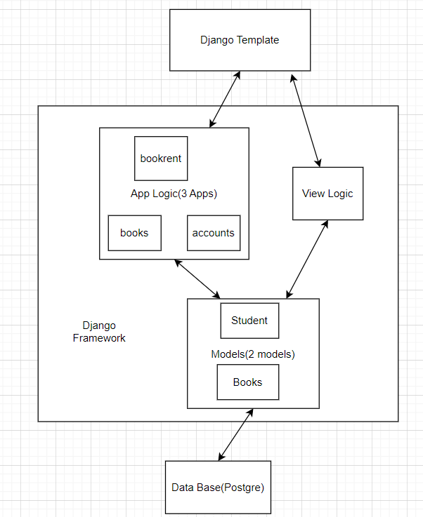

# CS222 projects--Book Rental Web Service(Textbook Rent System)

## Introduction

Our project is an alternative to existing software. On the internet, there are multiple products or web services for booking renting services, but our web service is specifically for students in UIUC. To be more specific, students of UIUC may have difficulties ordering and buying books at the beginning of the semester due to a large number of orders, or need books for studying and reference in the middle of the semester. So, we decide to create an alternative to existing book renting web service to address this problem, and our goal is to create a web page for book rental service, with various features embedded in our website.

Functionality:
1. Users could have their personal account on our website, and use Netid to login.
2. Staff users could post new available textbook information on the website.
3. Users could borrow textbooks on the website with the limit of 2 textbooks in total before
any returning.
4. Users could check the number of books they already borrowed.
5. Users could look up book information on the website.

 
## Technical Architecture

Technical Architecture:
   1. Front-end: html
   2. Back-end: Mysql, python
   3. Platform: Django

## Installation instructions
1. Clone the repo:

    $ git clone https://github.com/CS222-UIUC/course-project-team-51.git
   
2. Change directory into the web-app folder:
    
    $ cd bookrent
    
3. In the web-app directory, install django:
   
    $ pip3 install django
    
4. In the web-app directory and start the django app:
    
    $ python manage.py runserver
    
5. In your browser, go to [http://localhost/:3000](http//localhost:3000) to see the website locally.

## Group members and their roles
Members: 
   
   Haoran Wang, Chen Yang,  Zelong Liang, Xiuhao Ding

Roles:

   Front-end: Chen Yang, Zelong Liang, Haoran Wang
   
   Back-end: Xiuhao Ding 

## Development(Problems)
Problem 1:
When we uploaded the background image candidate locally and tries to apply the change, it failed with the reason of incorrect path. The solution is that we inspected the webpage where the image was located on and copies the image's url into our code which worked successfully. The solution is much easier as long as the image is still up on the internet.

Problem 2:
None of us used Django framework before so it is something completely new and the problem is to find useful information that works for us in
a short period of time. We ended up finding a tutorial on Youtube with decent length, a lot of contents and no course selling. Watching videos sometimes works much better than reading a lot of documents since it provides someone knowledge to teach you.
